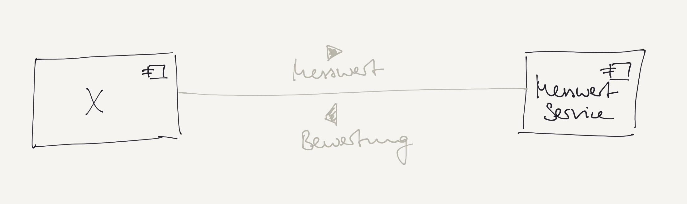

# Übung 6b: gRPC

## Szenario

In diesem stark vereinfachten Szenario gibt es einen **MesswertService**, der beispielhaft zwei Anwendungsfälle abdecken soll:
1. Ein einfaches **Speichern** einzelner `Messwert`-Objekte auf Serverseite 
2. Eine komplexere **Überwachung** von `Messwert`-Objekte, die `Bewertung`-Objekte an die aufrufende Komponente zurückschickt

Diese generelle Liefer- und Leistungsbeziehung beschreibt folgende Skizze:



## Aufgabenstellung

Mit Hilfe von **gRPC** sollen verschiedene Möglichkeiten der (a)synchronen Kommunikation zwischen den
Komponenten implementiert werden:

### Möglichkeit 1: Request/Reply á là gRPC

In gRPC gibt es kein echtes *Request/Reply*, da die Antwort an die aufrufende Komponente immer über 
einen Callback in Form eines *StreamObserver* (hier ein `StreamObserver<Bewertung>`) übermittelt wird.

Für diese Art der Umsetzung kann auf Aufruferseite bei Bedarf ein *Blocking Stub* genutzt werden, 
dieser blockiert dann solange, bis ein Reply erfolgt ist.

Nutzt man auf Aufruferseite einen normalen *Stub*, so müssen die Methoden des `StreamObserver`-Interfaces
implementiert werden. Darin werden die Antwortnachrichten empfangen, wie Sie dies von *Callbacks* her kennen.

Implementieren Sie diese Art der Kommunikation mit beiden Möglichkeiten auf der Aufruferseite, wie dies eben beschrieben wurde.

Beispiele für die versendeten Daten:

```scala
Messwert("Wasserstand Schleuse Regensburg", 9.40)                // mögliches Übergabeargument und/oder ...
Bewertung("Schleuse um 1 m öffnen", "2021-12-01 04:18:53")  // ... Rückgabeargument
```

### Möglichkeit 2: Callbacks/Streaming auch für den Übergabeparametertypen

Stellen Sie sich folgendes Szenario für den Anwendungsfall der **Überwachung** vor:
Sobald der Aufrufer die Servicemethode aufgerufen hat, ist es möglich, dass beliebig `Messwert`-Objekte übergeben
und (unabhängig davon) beliebig `Bewertung`-Objekte zurückgeschickt werden.

Beispiel:

```scala
// nach Serviceaufruf:
Messwert("Wasserstand Schleuse Regensburg", 6.25)           // --> an Service
Messwert("Wasserstand Schleuse Regensburg", 7.90)           // --> an Service, aber etwas später
Messwert("Wasserstand Schleuse Regensburg", 9.40)           // --> an Service, wieder etwas später
Bewertung("Schleuse um 1 m öffnen", "2021-12-01 04:18:53")  // <-- von Service
Messwert("Wasserstand Schleuse Regensburg", 9.90)           // --> an Service, wieder etwas später
Bewertung("Schleuse um 2 m öffnen", "2021-12-01 06:59:20")  // <-- von Service, erneut etwas zurückgeschickt
```

Dies ist möglich, indem sowohl der Über- als auch der Rückgabeparameter als `stream` gekennzeichnet werden.
Setzen Sie dies entsprechend um.