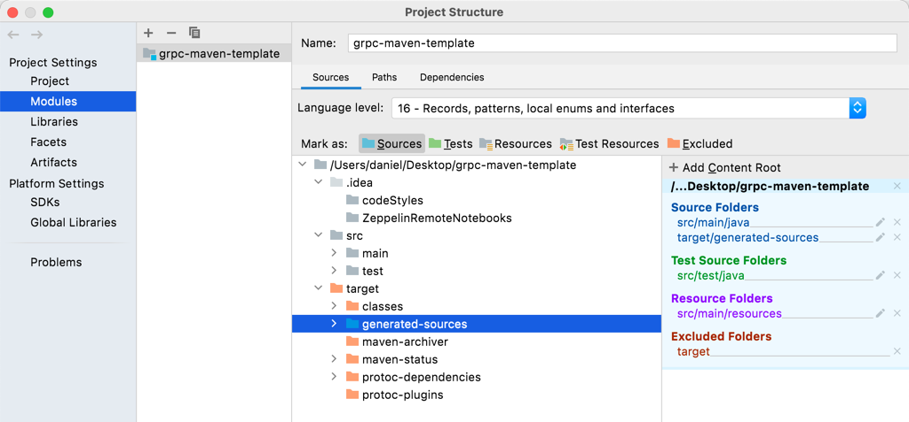

# gRPC Maven Template (Java)

## Documentation

- [gRPC Project Site](https://grpc.io)
- [gRPC Basic Java Tutorial](https://grpc.io/docs/languages/java/basics/)
- [grpc-java project on Github (with dependencies)](https://github.com/grpc/grpc-java/blob/master/README.md)
- [Protocol Buffers Version 3 Language Specification](https://developers.google.com/protocol-buffers/docs/reference/proto3-spec)
- [Protocol Buffers Well-Known Types](https://developers.google.com/protocol-buffers/docs/reference/google.protobuf)
- [One of many Youtube tutorials](https://www.youtube.com/watch?v=DU-q5kOf2Rc)

## Interface Definition

The interface definition is done in a `.proto` file in `src/main/proto` folder.
It is recommended to define a `.proto` file per service. 
The `.proto` file contains message and service definitions.

## Compilation

Message type classes, stub, and skeleton are usually created by a command line tool.
In a Maven environment the **protobuf plugin** is used. 
It is automatically executed together with the Maven `compile` goal.
You have to call `mvn compile` or use your IDE's Maven support to compile your project.
This will automatically create all Java classes (messages, stub, skeleton) for your defined service.
You find the generated code in the `target` folder in the defined package structure. (See also **IntelliJ Setup** below.)
Check out the [pom.xml](pom.xml) file if you are interested how the plugin and dependency elements are defined.

## Implementation

Say you defined a `service SampleService` in your `sample.proto`. 
After compiling the gRPC-compiler created the message classes as well the stub and skeleton classes. 
Their names are taken from your definitions in the `.proto` file.
You can now implement your service's functionality by extending a Java class with `extends SampleServiceGrpc.SampleServiceImplBase`.
Now you can override your defined service operations.

## IntelliJ Setup

**N.B.** In case the generated classes are not recognized by IntelliJ, you have to change the module settings
by marking the `target/generated_sources` as **Sources** (in blue):

