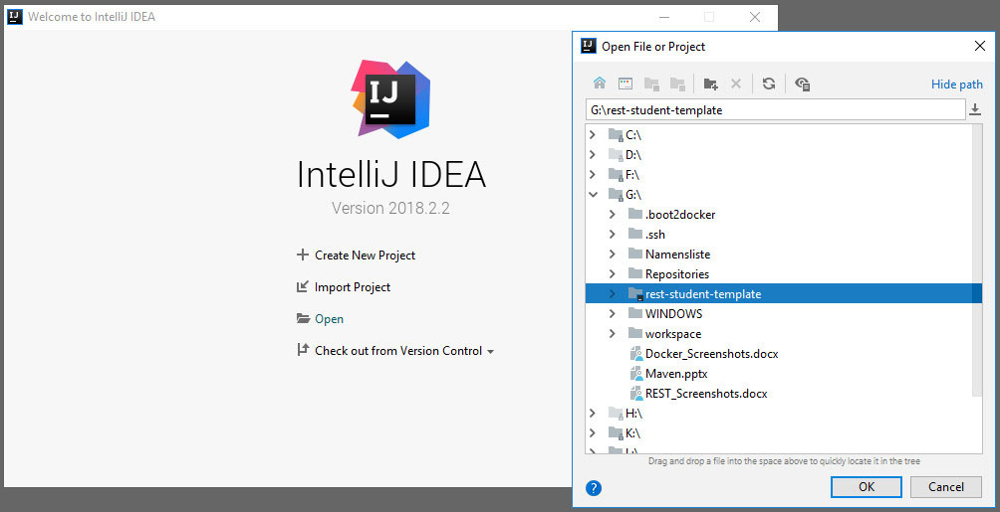
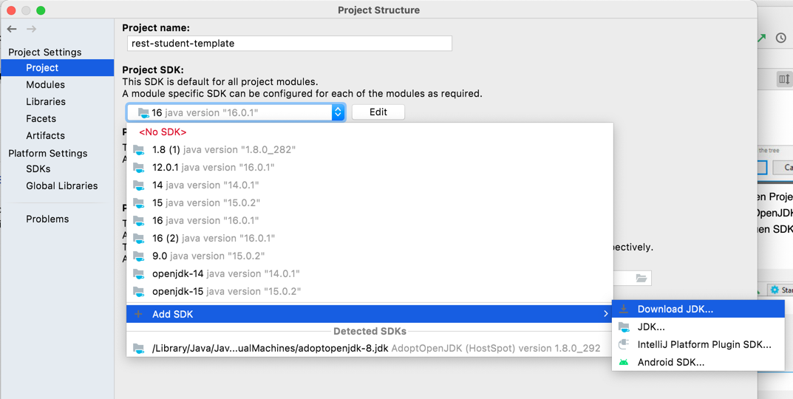

# Verteilte Systeme: RESTful Webservices

## Aufgabenstellung

Dies ist ein Projekt-Template für Ihre erste RESTful-Webservice-Applikation rund um die CRUD-Methoden der Ressource (Entity) *Student*.

Die Aufgabenstellung finden Sie [hier](AUFGABENSTELLUNG.md).

## Installation des Templates

> **Achtung**  Dieses Template ist nur gültig für *OpenJdk* ab Version *15*, *git* und die *IntelliJ IDEA*. Z. B. innerhalb der CIP-Pools im K-Gebäude!

1. Navigieren Sie zu einem Ordner Ihrer Wahl, in dem Sie das Projekt erstellen möchten
2. Öffnen Sie die Konsole (Windows Eingabeaufforderung *cmd*, Windows *PowerShell*, Mac *Terminal*)
3. Klonen Sie das Projekt (Template) mittels `git clone https://gitlab.oth-regensburg.de/jod39747/rest-student-template.git`; alternativ können Sie sich das Projekt aus gezippt herunterladen, nutzen Sie hierzu den Download-Button oben (in diesem Fall bitte beachten, dass das eigentliche Projektverzeichnis nochmals in einem Verzeichnis kopiert wird; zu öffnen ist das "innere" Verzeichnis!)
4. Starten Sie IntelliJ IDEA
5. Wählen Sie *Open* (nicht *Import*!) und wählen Sie das neu geklonte/kopierte Projektverzeichnis "rest-student-template" aus

6. Stellen Sie nun ggf. noch das JDK/SDK für Ihr Projekt ein. Öffnen Sie dazu die "Module Settings" durch rechten Mausklick auf den Projekt-Root-Ordner "rest-student-template" und wählen Sie "Open Module Settings". Im Tab "Project" wählen Sie Ihr installiertes SDK aus oder nutzen die Möglichkeit, ein JDK über diesen Dialog zu laden. Beispiel:

7. Ändern Sie die Konfigurationsdatei [`pom.xml`](pom.xml) den Eintrag für die Javaversion: `<java.version>16</java.version>` (Zeile 12)

## JAX-RS 2.1 RESTful Webservices in Java mit JAX-RS und Jersey

[Jakarta RESTful Web Services 3.0](https://jakarta.ee/specifications/restful-ws/3.0) spezifiziert die Unterstützung von RESTful-Webservice-APIs in Java. 

[Eclipse Jersey](https://eclipse-ee4j.github.io/jersey/) ist die zugehörige JAX-RS-Referenzimplementierung für eine konkrete Umsetzung. Nutzen Sie die Dokumentationsseiten und weitere Suchergebnisse im Netz zu diesen Themen, sofern Sie sich mit dieser Thematik tiefer befassen möchten.

## JAX-RS Clients

JAX-RS bietet natürlich auch API-Klassen an, um eine Client-Anwendung in Java zu implementieren. 

Im Rahmen der Übungen werden zur Vereinfachung aber nur Browser-Plugins als generische Client verwendet. 
Installieren Sie hierzu ein passendes Plugin für Ihren Browser, z. B.  [RESTer for Crome](https://chrome.google.com/webstore/detail/rester/eejfoncpjfgmeleakejdcanedmefagga?hl=en) oder für [Firefox](https://addons.mozilla.org/en-US/firefox/addon/rester/).

Alternativ sind auch ein Kommandozeilentool wie [HTTPie](https://httpie.io) oder ein umfänglicheres Testtool wie [Postman](https://www.postman.com/product/api-client/) möglich.

