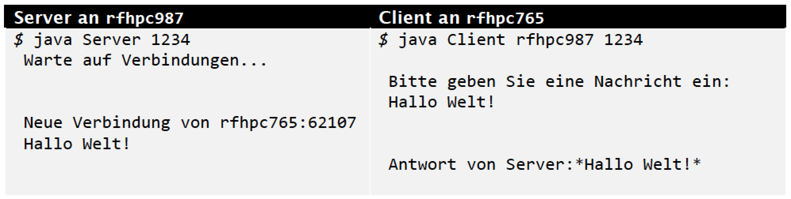

# Socket in Java

Es soll ein Client und ein Server entwickelt werden, die mittels TCP-Sockets Nachrichten austauschen. 
Der Client sendet den Text einer Usereingabe an den Server, dieser gibt sie auf der Konsole aus und sendet sie mit einem entsprechenden Präfix und/oder Postfix quittiert über die bestehende Verbindung zurück.

Binding-Port und Hostname können als einfache Variablen gesetzt werden oder wahlweise auch über die Konsole bei Prozessstart mit übergeben werden.

## Beispielausgaben

