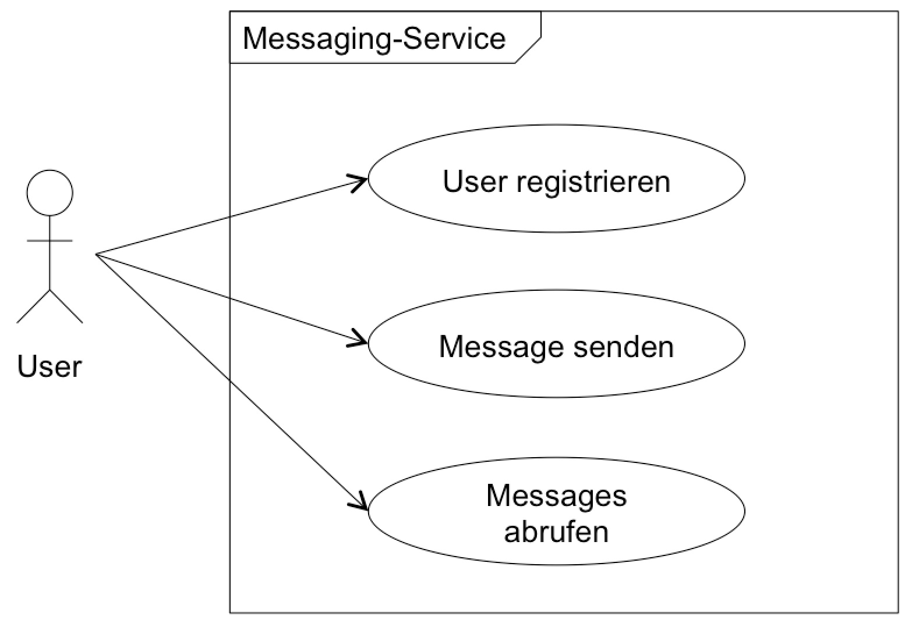
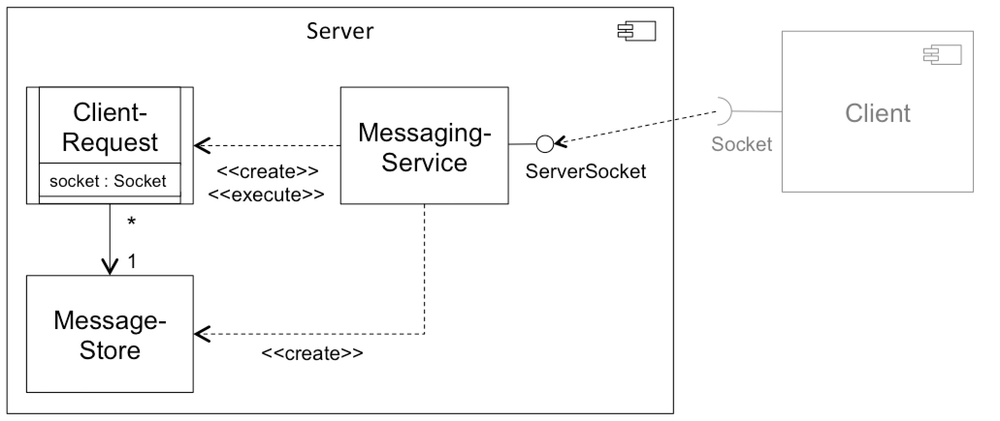
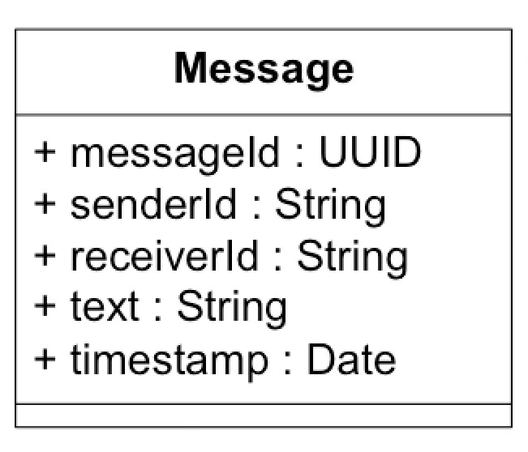

# messaging-service

## Verteiltes Messaging-System mit Hilfe von Sockets und Threads

Lösungsvorschlag zu Übungsblatt 4.

## Aufgabe

Ihre Aufgabe ist es, eine Serverkomponente eines Messaging-Systems zu entwickeln. 

Dieses Messaging-System soll folgende drei Anwendungsfälle umsetzen:

1.	**User registrieren**: Ein User soll sich mit einem beliebigen Usernamen  am Messaging-System einmalig registrieren können.
2.	**Message senden**: Ein User kann unter Angabe des Usernamens eine Message an einen anderen registrierten User senden. Das Messaging-System wird diese Message speichern.
3.	**Messages abrufen**: Ein User kann unter Angabe des Usernamens und des Passworts die Liste der gespeicherten Messages abrufen. Die abgerufen Messages werden anschließend im Messaging-System gelöscht.

Für jeden konkreten Anwendungsfall wird eine neue Socketverbindung aufgebaut und anschließend wieder geschlossen. Socketverbindungen bleiben nicht über Aufrufe hinweg geöffnet. Das Messaging-System soll eine zu große Last an gleichzeitigen Anfragen von Usern mit Hilfe eines „Threadpools“ verhindern.

Die Speicherung von Messages soll mit Hilfe einer eigenen Klasse umgesetzt werden. Diese passive Klasse muss *thread-safe* implementiert werden.

Für die Kommunikation mit dem Messaging-System müssen Sie sich ein Protokoll überlegen, dass es erlaubt, den Anwendungsfall und die zugehörigen Daten korrekt zu übertragen. Verwenden Sie hierzu passende „Framing“-Strategien (siehe hierzu auch nachfolgende Protokoll-Beispiele).


## Protokoll-Beispiele

### Beispiele für Nachrichten vom Client an den Messaging-Service:

- Registrierung mit Username *Lisa*:
```
REGLisa
```

- Sender einer Message von *Lisa* an *Tom*:
```
SNDLisa#Tom#Hi Thommy, how are you today?
```

- Abruf der Nachrichten von *Tom*:
```
RCVTom
```

### Beispiele für Nachrichten vom Messaging-Service an einen Client

- Informationsmeldung des Servers:
```
INFWelcome to OTH message service
```

- Fehlermeldung des Servers:
```
ERRProblem with received request. Request was: ...
```

- Antwort auf *RCV*-Befehl mit zwei Nachrichten in der Inbox:
```
OK 2
OK 4979352a-5b80-457a-921a-89f315cc727f#Lisa#Tom#Hi, Thommy, how are you?#Thu Apr 26 10:06:02 CEST 2018
OK 5297f194-cd2d-4d21-881a-6845a95cf695#John#Tom#Soccer today?#Thu Apr 26 10:07:44 CEST 2018
```

## Modelle

### Umzusetzende Anwendungsfälle



### Mögliche Komponentenaufteilung



### Entity-Klasse `Message` (optional)



