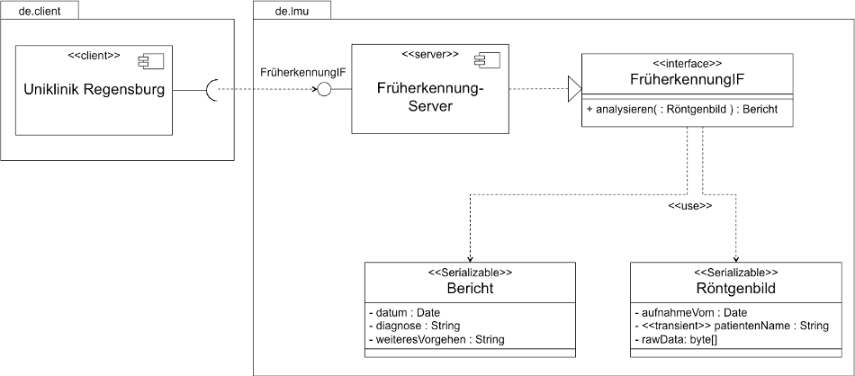

# Übungsblatt 5

## Implementierung eines RMI-Systems für einen Früherkennungs- Service für Kliniken

Das Universitätsklinikum der LMU München in Großhadern beauftragt Sie, ein RMI- System zu planen und zu implementieren, das eine Online-Früherkennung von Krankheiten auf Basis von Röntgenbildern erlaubt und dem Aufrufer einen ärztlichen Bericht mit dem Ergebnis der Früherkennung zukommen lässt.
In einer ersten Ausbaustufe soll folgendes Softwaredesign umgesetzt werden:

## Aufgabe

Implementieren Sie sowohl die Serverkomponenten sowie einen Testclient für obiges Szenario mit Hilfe von Java RMI. Alle Aufrufe sind zunächst „by value“.

